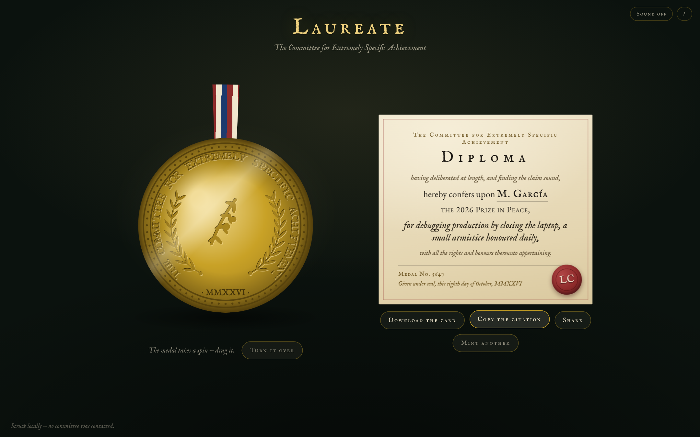

# Laureate



**Mint a Nobel-style gold medal and diploma for anyone's absurd achievement.**

**Live:** https://laureate.vercel.app

## What it does

Laureate is a tiny minting ceremony that runs entirely in your browser. State an achievement ("debugging production by closing the laptop"), choose a field of merit, press the mint, and a physical press strikes a gold medal for it. The medal spins in your hand, carries the recipient's name engraved on its back, and comes with a diploma and a shareable card. Every award gets a serial number, a ceremony date in Latin-flavoured prose, and a permalink (`#a=…`) that reproduces the exact same medal.

## How it works

The medal is drawn procedurally on canvas — no image assets. Both faces are pre-rendered to offscreen canvases: the front composes a radial-lit gold disc, rim lettering along a text arc, paired laurel branches, and a category emblem; the back engraves the recipient, serial and year. The strike reveals the relief through a radial emboss wavefront masked by `clip()`, so the design appears to be pressed into the metal rather than faded in.

The fun technical detail: awards are deterministic. `mint()` hashes the normalised petition (recipient + achievement + category) with a small FNV-style hash, so the same petition always selects the same serial number and citation; the mint date is captured once and stored in the award itself. Permalinks encode the whole award in the URL hash with a compact JSON + base64url codec, so a shared link re-mints the identical award — same serial, same engraving — on any machine. No server, no database: the award lives in the URL, and only your sound/guide preferences sit in `localStorage`.

## Local run

```bash
npm install
npm run dev
```

Build + preview:

```bash
npm run build
npm run preview
```

## Stack

React 19, TypeScript, Vite, canvas 2D, Web Audio (optional ceremony sounds, off by default), IM Fell English + EB Garamond via Fontsource. Playwright for interaction testing (`scripts/flow.mjs`, `scripts/capture.mjs`).

## License

MIT
